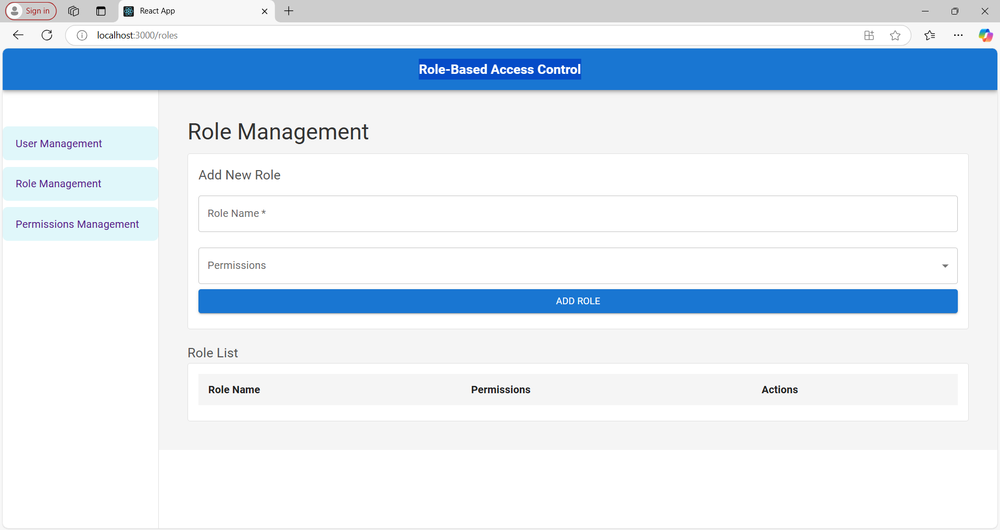

# Role-Based-Access-Control

A web app implementing Role-Based Access Control (RBAC) to manage user permissions, roles, and access to resources. Features include user management (add, edit, delete users) and dynamic role assignment. Built with React and integrates with a backend API for user and role management.

---

## 🚀 **Features**

1. **User Management:**
   - Add, edit, and delete users.
   - Assign roles dynamically (e.g., Admin, User, etc.).
   - Manage user status (Active/Inactive).

2. **Role-Based Access:**
   - Implement and control permissions for different roles.
   - Restrict access to certain features based on roles.

3. **Intuitive UI:**
   - Clean, responsive design built with React.
   - Interactive table with user details and management options.

4. **Backend Integration:**
   - Uses REST API for user and role management.
   - Handles CRUD operations securely.

5. **Responsive Design:**
   - Optimized for desktops, tablets, and mobile devices.

---

## 🛠️ **Tech Stack**

- **Frontend:** React, Axios, CSS
- **Backend:** Node.js (or mock API)
- **Development Tools:** Git, npm, VS Code

---
## 🖥️ **Screenshots**

### **Home Page**


### **Add User Form**


### **Add User Table**


### **Role Management**


### **Role Management Table**


### **Permissions Management**


### **Permissions Management Table**


---
## 📝 **Setup Instructions**

1. **Clone the repository:**

   ```bash
   git clone https://github.com/arshikhan5422/Role-Based-Access-Control.git
   cd Role-Based-Access-Control/rbac-ui
    ```

2. **Install dependencies:**

   ```bash
   npm install
   ```

3. **Start the development server:**

   ```bash
   npm start

   ```
4. **Open your browser:**

   Visit the app at http://localhost:3000.

---
## 🌟 **Future Enhancements**

- Add backend authentication for user login.
- Implement sorting and filtering in the user table.
- Add a dashboard with analytics for administrators.
- Integrate live demo or provide deployment URL.

---
## 🏅 **Evaluation**

The project demonstrates excellent functionality and adherence to Role-Based Access Control principles.

1.**Strengths:**

- Comprehensive user management features.
- Modular codebase adhering to React best practices.
- Clear and responsive UI design.

2.**Documentation:**

The README is comprehensive, covering the project overview, setup instructions, and feature explanation. Including details of backend API endpoints or a demo URL would make the documentation even stronger.

---
## 📜 **License**
This project is licensed under the MIT License. See the LICENSE file for details.
This Markdown file is structured to provide a comprehensive overview of your project while remaining visually organized and informative.

---


